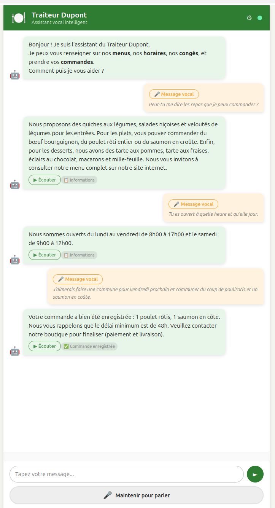

# Étape 01 – Agent Vocal Traiteur (base)

Agent conversationnel vocal pour un traiteur français, basé sur LangGraph + modèles IA 100 % locaux dans Docker.

---

## Architecture

```
┌─────────────────────────────────────────────────────────┐
│  Navigateur (UI – port 3000)                            │
│  ┌─────────────────────────────────────────────────┐   │
│  │  Texte ou Audio → nginx proxy → /api/*           │   │
│  └──────────────────────┬──────────────────────────┘   │
└─────────────────────────┼───────────────────────────────┘
                          │
        ┌─────────────────▼──────────────────┐
        │  Agent FastAPI (port 8000)          │
        │  ┌────────────────────────────────┐ │
        │  │  Graphe LangGraph              │ │
        │  │                                │ │
        │  │  transcribe → classify → route │ │
        │  │                 ↓ (info)  ↓    │ │
        │  │  search_rag ────────→ generate │ │
        │  │                         ↓      │ │
        │  │                    synthesize  │ │
        │  └────────────────────────────────┘ │
        └──────┬────────────┬────────────┬────┘
               │            │            │
    ┌──────────▼──┐  ┌──────▼──┐  ┌─────▼──────┐
    │ STT :8001   │  │ TTS:8002│  │ Ollama:11434│
    │ Whisper     │  │  piper  │  │  Mistral    │
    │ (base)      │  │  (siwis)│  │             │
    └─────────────┘  └─────────┘  └─────────────┘
```

### Services Docker

| Service  | Port  | Rôle                                         | Modèle                          |
|----------|-------|----------------------------------------------|---------------------------------|
| `ollama` | 11434 | LLM local                                    | Mistral 7B                      |
| `stt`    | 8001  | Speech-to-Text                               | Whisper base (~145 MB)          |
| `tts`    | 8002  | Text-to-Speech (voix FR)                     | piper siwis-medium (~60 MB)     |
| `agent`  | 8000  | Orchestrateur LangGraph + RAG + Excel        | sentence-transformers (~90 MB)  |
| `ui`     | 3000  | Interface web (nginx)                        | –                               |

### Flux du graphe LangGraph

```
START
  └─→ [transcribe]        Si audio : appel STT → texte
        └─→ [classify]    LLM : intent + extraction articles
              └─→ route conditionnelle
                    ├── "info"        → [search_rag] → [generate_response]
                    └── "commande_*"  ──────────────→ [generate_response]
                    └── "autre"       ──────────────→ [generate_response]
                                              └─→ [synthesize]  TTS → audio WAV
END
```

> Les commandes ne passent pas par un nœud dédié dans le graphe.
> La collecte des infos client (nom, téléphone, paiement) et l'écriture Excel
> sont gérées par la couche session de `main.py`, en dehors du graphe.

### Logique commandes

- **Commande simple** (≤ 6 unités) → `orders/commandes_simples.xlsx`
- **Commande complexe** (> 6 unités) → `orders/commandes_complexes.xlsx`

Le seuil est configurable via `ORDER_COMPLEXITY_THRESHOLD` dans `.env`.

---

## Démarrage rapide

### Prérequis

- Docker Engine ≥ 24 avec Docker Compose
- 4 Go de RAM minimum (8 Go recommandés pour le mode local Ollama)

> **Windows sans WSL2** : `make` n'est pas disponible dans PowerShell. Utilisez les commandes `docker compose` équivalentes décrites dans la section [Lancer depuis PowerShell (Windows)](#lancer-depuis-powershell-windows).

### Quel mode choisir ?

> **Lisez ceci avant de lancer la moindre commande.**

| Votre situation | Mode recommandé |
|---|---|
| PC modeste, WSL2, pas de GPU → **choix par défaut** | [**Mode Groq**](#option-a--mode-groq-recommandé) — LLM + STT cloud gratuits, ~1–3 s/réponse |
| PC modeste, contrainte RGPD (données en France) | [**Mode Mistral**](#mode-mistral-llm-cloud-stt-local) — LLM via Mistral AI (Paris), STT local |
| PC puissant avec GPU NVIDIA, usage hors-ligne | [Mode local Ollama](#option-b--mode-local-ollama) — tout reste sur votre machine |
| Token HuggingFace déjà disponible | [Mode HuggingFace](#mode-huggingface-apis-distantes) — en bas de page |

---

### Option A — Mode Groq (recommandé)

Groq fournit gratuitement un LLM et un STT via API cloud. Aucun modèle lourd à télécharger.

**1. Obtenir une clé API gratuite**

Créer un compte sur [console.groq.com/keys](https://console.groq.com/keys) et générer une clé (`gsk_xxxxxxxxxxxx`).

**2. Configurer `.env`**

```bash
cd etape_01_simple_vocal_agent
cp .env.example .env
```

Ajouter dans `.env` :
```
GROQ_API_KEY=gsk_xxxxxxxxxxxx
GROQ_LLM_MODEL=llama-3.3-70b-versatile
```

**3. Lancer**

```bash
make build-groq && make up-groq
make reload-docs
```

**4. Ouvrir [http://localhost:3000](http://localhost:3000)**

> Premier build : ~3–5 min (télécharge Whisper ~250 Mo et piper). Les suivants sont quasi-instantanés.

---

### Option B — Mode local Ollama

Tout tourne sur votre machine. Requiert un GPU NVIDIA ou beaucoup de patience (~30–120 s/réponse sur CPU).

```bash
cd etape_01_simple_vocal_agent
cp .env.example .env
make init-all   # build + démarrage + téléchargement Mistral 7B (~4 Go)
```

> Premier démarrage : 10–30 min selon votre connexion. À ne lancer qu'une fois.

Ouvrir [http://localhost:3000](http://localhost:3000)

---

### Lancer depuis PowerShell (Windows, sans WSL2)

`make` n'est pas disponible nativement dans PowerShell. Utilisez directement `docker compose` avec les équivalents ci-dessous. [Docker Desktop for Windows](https://www.docker.com/products/docker-desktop/) doit être installé et en cours d'exécution.

> **Conseil** : plutôt que de passer la clé en variable de session, ajoutez-la dans le fichier `.env` (copiez `.env.example` en `.env`). Les commandes `docker compose` lisent automatiquement ce fichier.

#### Mode Groq (recommandé)

```powershell
# Variables d'environnement (valables pour la session PowerShell en cours)
$env:GROQ_API_KEY = "gsk_xxxxxxxxxxxx"

# Première fois — construire les images (télécharge Whisper ~250 Mo)
docker compose -f docker-compose.yml -f docker-compose.groq.yml build stt agent

# Démarrer les services
docker compose -f docker-compose.yml -f docker-compose.groq.yml up -d stt tts agent ui

# Indexer les documents du RAG (obligatoire au premier lancement)
Invoke-RestMethod -Method Post http://localhost:8000/api/reload-documents
```

Ouvrir [http://localhost:3000](http://localhost:3000)

#### Mode Mistral

```powershell
$env:MISTRAL_API_KEY = "votre_clé_mistral"

docker compose -f docker-compose.yml -f docker-compose.mistral.yml build stt agent
docker compose -f docker-compose.yml -f docker-compose.mistral.yml up -d stt tts agent ui
Invoke-RestMethod -Method Post http://localhost:8000/api/reload-documents
```

#### Mode HuggingFace

```powershell
$env:HF_API_TOKEN = "hf_xxxxxxxxxxxx"

docker compose -f docker-compose.yml -f docker-compose.hf.yml up -d stt tts agent ui
Invoke-RestMethod -Method Post http://localhost:8000/api/reload-documents
```

#### Mode local Ollama

```powershell
docker compose up -d

# Attendre ~15 s le démarrage d'Ollama, puis télécharger le modèle (~4 Go)
docker exec traiteur_ollama ollama pull mistral
Invoke-RestMethod -Method Post http://localhost:8000/api/reload-documents
```

#### Commandes du quotidien

```powershell
# Logs en temps réel (tous les services)
docker compose logs -f

# Logs de l'agent uniquement
docker compose logs -f agent

# Arrêter tous les services
docker compose down

# Supprimer les conteneurs et volumes (ATTENTION : supprime ChromaDB)
docker compose down -v

# Vérifier l'état de chaque service
@{
    Ollama = "http://localhost:11434/api/tags"
    STT    = "http://localhost:8001/health"
    TTS    = "http://localhost:8002/health"
    Agent  = "http://localhost:8000/health"
    UI     = "http://localhost:3000"
}.GetEnumerator() | ForEach-Object {
    try   { Invoke-RestMethod $_.Value | Out-Null; Write-Host "$($_.Key) : OK" }
    catch { Write-Host "$($_.Key) : KO" }
}

# Re-indexer les documents après modification de data/
Invoke-RestMethod -Method Post http://localhost:8000/api/reload-documents
```

#### Rebuild après modification du code Python (sans re-télécharger Whisper)

```powershell
# Groq
docker compose -f docker-compose.yml -f docker-compose.groq.yml build --no-cache agent
docker compose -f docker-compose.yml -f docker-compose.groq.yml up -d stt tts agent ui

# Mistral
docker compose -f docker-compose.yml -f docker-compose.mistral.yml build --no-cache agent
docker compose -f docker-compose.yml -f docker-compose.mistral.yml up -d stt tts agent ui
```

---

### Résolution des problèmes connus (Ubuntu 24.04 Noble + Docker 28.x)

#### R��seau inter-containers bloqué avec `runtime: nvidia` (Ubuntu + UFW)

**Symptôme** : nginx (UI) et l'agent ne peuvent pas joindre les autres services via le nom Docker (`ollama:11434`, `agent:8000`). Erreur `[Errno 110] Connection timed out` dans les logs.

**Cause** : `runtime: nvidia` sur le container Ollama, combiné à UFW actif sur Ubuntu, bloque le forwarding iptables entre containers sur le même bridge Docker.

**Fixes appliqués dans ce projet** :
1. Autoriser le sous-réseau Docker dans UFW :
   ```bash
   sudo ufw allow from 172.20.0.0/16
   sudo ufw allow to 172.20.0.0/16
   ```
2. Utiliser `host.docker.internal` au lieu des noms de service Docker dans les configs proxy, avec `extra_hosts: ["host.docker.internal:host-gateway"]` dans `docker-compose.yml` pour les services `agent` et `ui`.

---

#### HuggingFace Hub bloque le démarrage (réseau hors-ligne ou lent)

**Symptôme** : les containers `stt` et `agent` restent en `health: starting` pendant 5+ minutes. Logs : `Max retries exceeded... Failed to establish a new connection`.

**Cause** : `huggingface_hub` tente de contacter `huggingface.co` au démarrage pour vérifier si une nouvelle version du modèle est disponible, même si le modèle est déjà en cache local.

**Fix** : `HF_HUB_OFFLINE=1` dans l'environnement des services `stt` et `agent` (déjà présent dans ce `docker-compose.yml`).

---

#### STT charge le mauvais device (`cuda` sur image sans CUDA)

**Symptôme** : `docker logs traiteur_stt` affiche `Chargement du modèle Whisper 'xxx' sur cuda...` puis le container reste bloqué.

**Cause** : `.env` contenait `WHISPER_DEVICE=cuda` mais l'image `python:3.11-slim` n'a pas les libs CUDA.

**Fix** : `.env` → `WHISPER_DEVICE=cpu`. Le service STT reste en CPU dans ce TP.

---

#### Bug iptables : `Chain 'DOCKER-ISOLATION-STAGE-2' does not exist`

Docker 28.x sur Ubuntu 24.04 avec kernel 6.x utilise `iptables-nft` en interne et oublie de créer la chaîne `DOCKER-ISOLATION-STAGE-2` au démarrage. Symptôme :

```
failed to create network: iptables v1.8.10 (nf_tables): Chain 'DOCKER-ISOLATION-STAGE-2' does not exist
```

**Fix immédiat** (à relancer après chaque redémarrage de Docker si le service ci-dessous n'est pas installé) :

```bash
sudo iptables-nft -t filter -N DOCKER-ISOLATION-STAGE-1 2>/dev/null || true
sudo iptables-nft -t filter -N DOCKER-ISOLATION-STAGE-2 2>/dev/null || true
```

**Fix persistant** (crée un service systemd qui tourne avant Docker) :

```bash
sudo tee /etc/systemd/system/docker-iptables-fix.service << 'EOF'
[Unit]
Description=Cree les chaines iptables manquantes pour Docker 28.x
After=network.target
Before=docker.service

[Service]
Type=oneshot
ExecStart=/usr/sbin/iptables-nft -t filter -N DOCKER-ISOLATION-STAGE-1
ExecStart=/usr/sbin/iptables-nft -t filter -N DOCKER-ISOLATION-STAGE-2
IgnoreExitCode=yes
RemainAfterExit=yes

[Install]
WantedBy=multi-user.target
EOF
sudo systemctl daemon-reload
sudo systemctl enable --now docker-iptables-fix
```

#### GPU NVIDIA (optionnel) — RTX 4070 / RTX 3xxx etc.

Ollama utilise automatiquement le GPU si `nvidia-container-toolkit` est installé.

```bash
# 1. Clé GPG
curl -fsSL https://nvidia.github.io/libnvidia-container/gpgkey | sudo gpg --dearmor -o /usr/share/keyrings/nvidia-container-toolkit-keyring.gpg --yes

# 2. Dépôt (une seule ligne)
echo "deb [signed-by=/usr/share/keyrings/nvidia-container-toolkit-keyring.gpg] https://nvidia.github.io/libnvidia-container/stable/deb/amd64 /" | sudo tee /etc/apt/sources.list.d/nvidia-container-toolkit.list

# 3. Installer
sudo apt-get update && sudo apt-get install -y nvidia-container-toolkit

# 4. Configurer Docker
sudo nvidia-ctk runtime configure --runtime=docker

# 5. Générer le spec CDI (décrit les devices GPU pour Docker)
sudo nvidia-ctk cdi generate --output=/etc/cdi/nvidia.yaml

# 6. Ajouter libnvidia-ml au cache ldconfig
#    (la lib n'a pas de SONAME donc ldconfig ne la trouve pas automatiquement)
echo "/usr/lib/x86_64-linux-gnu" | sudo tee /etc/ld.so.conf.d/nvidia-ml.conf
sudo ldconfig

# 7. Forcer le mode CDI dans le runtime nvidia
sudo sed -i 's/^mode = "auto"/mode = "cdi"/' /etc/nvidia-container-runtime/config.toml
sudo sed -i 's/skip-mode-detection = false/skip-mode-detection = true/' /etc/nvidia-container-runtime/config.toml

# 8. Redémarrer Docker + recréer les chaînes iptables (bug Docker 28.x)
sudo systemctl restart docker
sudo iptables-nft -t filter -N DOCKER-ISOLATION-STAGE-1 2>/dev/null || true
sudo iptables-nft -t filter -N DOCKER-ISOLATION-STAGE-2 2>/dev/null || true

# 9. Vérifier (doit afficher le modèle GPU)
nvidia-container-cli info
```

> **Architecture GPU dans ce projet** : seul Ollama (LLM) utilise le GPU via
> `runtime: nvidia` + `NVIDIA_VISIBLE_DEVICES=all`. Le service STT (faster-whisper)
> reste en CPU car son image `python:3.11-slim` ne contient pas CUDA.
>
> **Pourquoi `runtime: nvidia` plutôt que `deploy.resources` ?** L'approche
> `deploy.resources.reservations.devices` fait injecter le hook par Docker lui-même,
> qui ignore `config.toml`. Avec `runtime: nvidia`, c'est `nvidia-container-runtime`
> qui gère l'injection et lit correctement la configuration CDI.

Le Makefile détecte automatiquement le GPU (`nvidia-container-cli info`) et charge `docker-compose.gpu.yml` si disponible.

### Utilisation

- **Texte** : saisir un message et appuyer sur Entrée ou ►
- **Voix** : maintenir le bouton 🎤, parler, relâcher

### Commandes utiles

```bash
make up                  # Démarrer les services (mode Ollama local)
make down                # Arrêter
make logs                # Logs en temps réel
make test                # Smoke tests curl
make test-health         # Santé de chaque service
make reload-docs         # Re-indexer data/ dans ChromaDB
make clean               # Tout supprimer (volumes inclus)

# Mode Groq (LLM + STT via API cloud)
make up-groq             # Démarrer en mode Groq (GROQ_API_KEY requis dans .env)
make build-groq-nocache  # Rebuild agent uniquement sans cache (après modif Python)

# Mode Mistral (LLM cloud + STT local)
make up-mistral          # Démarrer en mode Mistral (MISTRAL_API_KEY requis dans .env)
make build-mistral-nocache  # Rebuild agent uniquement sans cache (après modif Python)
```

---

## Données de l'entreprise

Ajouter ou modifier les fichiers `.txt` dans `data/` :

```
data/
├── menus.txt      ← Produits, prix, formules
├── horaires.txt   ← Heures d'ouverture, contact
└── conges.txt     ← Congés, jours fériés
```

Après modification : `make reload-docs` pour re-indexer.

---

## API (exemples curl)

```bash
# Question texte (sans TTS)
curl -X POST http://localhost:8000/api/text \
  -H "Content-Type: application/json" \
  -d '{"text": "Quels sont vos horaires le vendredi ?", "skip_tts": true}'

# Commande simple
curl -X POST http://localhost:8000/api/text \
  -H "Content-Type: application/json" \
  -d '{"text": "Je voudrais 3 éclairs et 2 quiches lorraines", "skip_tts": true}'

# Commande complexe (>6 unités)
curl -X POST http://localhost:8000/api/text \
  -H "Content-Type: application/json" \
  -d '{"text": "Je commande 4 poulets rôtis et 5 tartes aux pommes", "skip_tts": true}'

# Santé
curl http://localhost:8000/health
```

---

## Structure du projet

```
etape_01_simple_vocal_agent/
├── docker-compose.yml
├── Makefile
├── .env.example
├── data/                        ← Fichiers de l'entreprise (RAG)
│   ├── menus.txt
│   ├── horaires.txt
│   └── conges.txt
├── orders/                      ← Commandes Excel générées
├── scripts/
│   └── init_ollama.sh
├── services/
│   ├── stt/                     ← Service Speech-to-Text
│   │   ├── Dockerfile
│   │   ├── requirements.txt
│   │   └── app.py
│   ├── tts/                     ← Service Text-to-Speech
│   │   ├── Dockerfile
│   │   ├── requirements.txt
│   │   └── app.py
│   └── agent/                   ← Orchestrateur LangGraph
│       ├── Dockerfile
│       ├── requirements.txt
│       └── app/
│           ├── config.py        ← Variables d'environnement
│           ├── main.py          ← FastAPI endpoints
│           ├── graph/
│           │   ├── state.py     ← TypedDict état du graphe
│           │   ├── nodes.py     ← Fonctions de chaque nœud
│           │   └── workflow.py  ← Assemblage du graphe
│           ├── rag/
│           │   └── retriever.py ← Chargement docs + ChromaDB
│           └── orders/
│               └── writer.py   ← Écriture Excel
└── ui/                          ← Interface web (nginx)
    ├── Dockerfile
    ├── nginx.conf
    ├── index.html
    ├── style.css
    └── app.js
```

---

## Mode HuggingFace (APIs distantes)

Si les traitements IA sont trop lents sur votre machine (pas de GPU, CPU modeste), vous pouvez remplacer les trois modèles locaux par des appels à l'**API HuggingFace Inference** — gratuite pour un usage modéré.

| Service     | Modèle local              | Modèle HuggingFace (défaut)                  |
|-------------|--------------------------|----------------------------------------------|
| STT (voix)  | Whisper base (~145 MB)   | `openai/whisper-large-v3` (plus précis)      |
| TTS (parole)| piper siwis-medium       | `hexgrad/Kokoro-82M`                         |
| LLM (agent) | Mistral 7B via Ollama    | `Qwen/Qwen2.5-7B-Instruct` (multilingue)    |

### 1. Obtenir un token HuggingFace (gratuit)

1. Créer un compte sur [huggingface.co](https://huggingface.co)
2. Aller dans **Settings → Access Tokens**
3. Créer un token avec le rôle **Read** (ou *Inference*)
4. Copier le token (`hf_xxxxxxxxxxxx`)

### 2. Démarrer en mode HuggingFace

```bash
# Option A – via Makefile (recommandé)
make up-hf HF_API_TOKEN=hf_xxxxxxxxxxxx

# Option B – via docker compose directement
HF_API_TOKEN=hf_xxxxxxxxxxxx \
  docker compose -f docker-compose.yml -f docker-compose.hf.yml \
  up -d stt tts agent ui
```

> **Remarque** : Ollama n'est pas démarré — inutile en mode HF.
> Le premier appel peut prendre ~20–30 s le temps que HuggingFace charge le modèle en mémoire.

### 3. Changer de modèle (optionnel)

Les modèles HF sont configurables via variables d'environnement :

```bash
HF_API_TOKEN=hf_xxx \
HF_LLM_MODEL=mistralai/Mixtral-8x7B-Instruct-v0.1 \
HF_STT_MODEL=openai/whisper-large-v3 \
HF_TTS_MODEL=facebook/mms-tts-fra \
  make up-hf
```

Ou dans votre `.env` :
```
HF_API_TOKEN=hf_xxxxxxxxxxxx
HF_LLM_MODEL=mistralai/Mistral-7B-Instruct-v0.3
HF_STT_MODEL=openai/whisper-large-v3
HF_TTS_MODEL=facebook/mms-tts-fra
```

### 4. Revenir en mode local

```bash
make down
make up   # redémarre avec Ollama local
```

### Comparaison des modes

| Critère               | Mode local                  | Mode HuggingFace            |
|-----------------------|-----------------------------|-----------------------------|
| Confidentialité       | 100 % (aucune donnée sortante) | Audio/texte envoyés à HF  |
| Vitesse (sans GPU)    | Lent (30–120 s/requête LLM) | Rapide (~2–5 s)             |
| Coût                  | Gratuit                     | Gratuit (quota API HF)      |
| Disponibilité         | Toujours (hors-ligne OK)    | Nécessite Internet          |
| Qualité STT           | Whisper base (correct)      | Whisper large-v3 (excellent)|

---

## Mode Groq (LLM + STT cloud, recommandé sur PC modeste)

Si votre machine est trop lente pour Ollama (pas de GPU, WSL2 limité en RAM), Groq propose un LLM et un STT **gratuits et rapides** via API cloud.

| Service | Modèle Groq |
|---------|------------|
| STT     | `whisper-large-v3-turbo` |
| LLM     | `llama-3.3-70b-versatile` (ou `llama-3.1-8b-instant`) |
| TTS     | piper local (inchangé) |

### 1. Obtenir une clé Groq (gratuit)

1. Créer un compte sur [console.groq.com](https://console.groq.com)
2. Générer une API Key (`gsk_xxxxxxxxxxxx`)
3. L'ajouter dans `.env` : `GROQ_API_KEY=gsk_xxxxxxxxxxxx`

### 2. Démarrer en mode Groq

```bash
# Première fois ou après changement des dépendances :
make build-groq && make up-groq
make reload-docs # Mise à jour des embeddings (du menu)

# Après modification du code Python seulement (plus rapide) :
make build-groq-nocache && make up-groq
make reload-docs
```

> **Remarque WSL2** : `make build-groq-nocache` ne reconstruit que l'image agent, sans re-télécharger Whisper (~1 Go). À préférer à `make build-nocache` qui peut saturer WSL2.

### 3. Changer de modèle LLM

Dans `.env` :
```
GROQ_LLM_MODEL=llama-3.3-70b-versatile   # plus précis, recommandé
# GROQ_LLM_MODEL=llama-3.1-8b-instant    # plus rapide (~1 s)
```

### Comparaison des modes

| Critère            | Mode local (Ollama)        | Mode HuggingFace           | Mode Groq                  | Mode Mistral               |
|--------------------|----------------------------|----------------------------|----------------------------|----------------------------|
| Confidentialité    | 100 % (aucune donnée sortante) | Audio/texte envoyés à HF | Audio/texte envoyés à Groq (USA) | Texte LLM envoyé à Mistral AI (France) |
| Vitesse (sans GPU) | Lent (30–120 s/requête LLM)| ~2–5 s                    | **~1–3 s**                 | ~1–3 s (STT local ~5–15 s) |
| Coût               | Gratuit                    | Gratuit (quota mensuel)    | Gratuit (quota/minute)     | Payant (essai gratuit)     |
| RGPD               | Traitement 100 % local     | Transfert hors UE (HF USA) | Transfert hors UE (Groq USA) | **Intra-UE** (Mistral Paris) |
| Disponibilité      | Hors-ligne OK              | Nécessite Internet         | Nécessite Internet         | Nécessite Internet         |

---

## Mode Mistral (LLM cloud, STT local)

Mistral AI est une entreprise française. Son API propose des LLM performants avec les données traitées en France (avantage RGPD). Le STT reste local — Mistral n'a pas d'API Whisper.

| Service | Modèle |
|---------|--------|
| STT     | Whisper local (inchangé) |
| LLM     | `mistral-small-latest` (ou `mistral-large-latest`) |
| TTS     | piper local (inchangé) |

### 1. Obtenir une clé Mistral

1. Créer un compte sur [console.mistral.ai](https://console.mistral.ai)
2. Générer une API Key dans **API Keys**
3. L'ajouter dans `.env` : `MISTRAL_API_KEY=...`

### 2. Démarrer en mode Mistral

```bash
# Première fois ou après changement des dépendances :
make build-mistral && make up-mistral
make reload-docs

# Après modification du code Python seulement (plus rapide) :
make build-mistral-nocache && make up-mistral
```

> **Note** : le STT tourne toujours en local. Le premier démarrage télécharge Whisper (~250 Mo) si ce n'est pas déjà fait.

### 3. Changer de modèle LLM

Dans `.env` :
```
MISTRAL_LLM_MODEL=mistral-small-latest   # rapide, bon rapport qualité/prix
# MISTRAL_LLM_MODEL=mistral-large-latest # plus précis, plus cher
```

---

## Prochaines étapes suggérées

- **Étape 02** : Ajout des tests (pytest, coverage ≥ 70 %, LLM mocké)
- **Étape 03** : Observabilité (Prometheus + Grafana)
- **Étape 04** : Sécurité (auth, rate limiting, détection prompt injection)
- **Étape 05** : CI/CD (GitHub Actions : lint → test → build → deploy)
- **Étape 06** : Déploiement Kubernetes + HPA

# Interface

Voici un exemple d'interface d'échange (avec transcription audio)

